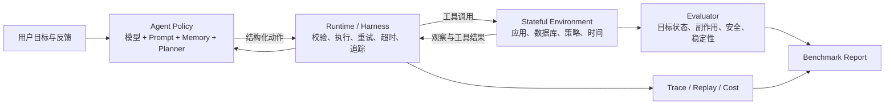

# 从“会调用工具”到“可靠完成任务”：Agent Runtime、状态化环境与可信 Benchmark 综述

> 文献快照：2026-08-06；详细条目见 [30 篇论文证据矩阵](./01_30篇论文证据矩阵.csv)。

## 摘要

过去三年，Agent 研究的中心已从“模型能否生成一次正确的函数调用”，转向“Agent 能否在持续变化、信息不完全、工具可能失败、用户会反馈、动作会产生副作用的环境中，稳定且安全地完成长程任务”。真正决定产品可用性的，不再只是基座模型能力，而是四层系统是否共同成立：**Agent policy 决定下一步，Runtime 可靠执行并记录交互，Environment 保存可验证状态，Benchmark 判断目标完成、副作用、安全与重复稳定性**。

30 篇文献共同揭示了一个空缺：已有工作往往只做好其中一部分。BrowserGym 擅长统一接口和实验编排，AppWorld 擅长确定性状态世界，ToolSandbox 擅长有状态工具与多路径评测，AgentDojo 擅长动态攻击与安全指标，ABC 擅长检查基准是否真的在测目标能力；但还缺少一个面向个人可复现、把**运行时、状态、恢复、有效性审计和可视化轨迹**整合起来的工程系统。

因此，本综述建议构建 **Agent Reliability Lab（ARL）**：在版本固定的本地状态环境中，对同一任务成对运行 clean 与 recoverable-fault 条件，使用状态差分、milestone/minefield、safe-success、recovery rate 和 `Pass^3` 联合评测，并从第一天内置 oracle、do-nothing、reset hash 和 evaluator mutation 等反作弊门禁。这比再做一个通用聊天 Agent 更贴合 MiniMax JD 中的 Environment、Runtime、Infra、数据、Benchmark、用户体验与效果定义。

## 1. 领域边界：究竟在研究什么

可以把一个产品 Agent 写成如下闭环：

其中：

- **核心状态**：用户、订单、日历、邮件、权限、策略、时间和任务进度，而不只是对话历史。
- **动作**：工具调用、代码执行、向用户澄清、等待、重试、补偿或拒绝。
- **约束**：工具 schema、业务政策、权限、安全边界、成本、时延和不可逆副作用。
- **成功**：目标状态成立，而且未产生不允许的状态变化；多次运行仍能成功。

这一定义把本领域与普通 RAG、单轮 function calling 和只做 UI 的 Agent demo 区分开。RAG 可以是观察来源，function calling 可以是动作编码，UI 可以是入口，但都不是完整运行时与评测系统。

## 2. 检索与筛选方法

本轮纳入 2023—2026 年与以下问题直接相关的 30 篇论文：工具使用范式、Agent-Computer Interface、浏览器/桌面/应用环境、用户在环任务、状态化评测、鲁棒性、安全和 benchmark validity。优先级依次为：

1. 顶级会议主会或 Datasets & Benchmarks track；
2. 顶级研究机构或有真实产品环境的工业团队；
3. 有官方代码、数据、可执行 evaluator 或清晰环境规范；
4. 能转化为独立项目中的一个可验证模块；
5. 2025—2026 年前沿预印本仅在明确补上旧工作缺口时纳入，并标注“尚待社区验证”。

证据采用两层：6 篇候选支柱完成全文和代码仓库精读；其余论文至少核验官方论文页/摘要、官方仓库和与本项目有关的机制。综述不是按论文逐篇复述，而是围绕同一工程问题做机制比较。30 篇逐项证据、代码状态和局限均在 CSV 中保留，避免“只列标题、不知道为什么选”。

## 3. 第一阶段：从推理轨迹到 Agent-Computer Interface

[ReAct](https://openreview.net/forum?id=WE_vluYUL-X) 的关键贡献不是一种固定 prompt，而是把推理与环境动作变成显式交替序列。它奠定了当今大多数工具 Agent 的控制循环，也提供了最容易解释的 baseline：如果任务失败，可以沿轨迹判断是理解错误、规划错误、选错工具、参数错误，还是观察后没有更新计划。

[Toolformer](https://proceedings.neurips.cc/paper_files/paper/2023/hash/d842425e4bf79ba039352da0f658a906-Abstract-Conference.html)、[ToolLLM](https://openreview.net/forum?id=dHng2O0Jjr) 和 [Gorilla](https://proceedings.neurips.cc/paper_files/paper/2024/hash/e4c61f578ff07830f5c37378dd3ecb0d-Abstract-Conference.html) 把研究推进到“如何学会何时调用、如何检索大量 API、如何减少 API 幻觉”。[CodeAct](https://proceedings.mlr.press/v235/wang24h.html) 则把可执行代码作为统一动作空间，避免复杂任务被拆成大量低效 JSON 调用。

但这些工作主要改善**动作生成**。实际产品仍会遇到：动作语法正确但状态已过期；调用返回成功却修改了错误对象；第一次成功、第二次失败；工具异常后重复提交造成副作用。于是研究焦点从模型输出转向接口和运行时。[SWE-agent](https://proceedings.neurips.cc/paper_files/paper/2024/hash/5a7c947568c1b1328ccc5230172e1e7c-Abstract-Conference.html) 表明，给 Agent 设计更适合的浏览、编辑和反馈接口，本身就能显著改变任务表现。这对产品研发很重要：**Agent 能力是模型与环境接口的联合属性，不是模型单项属性。**

## 4. 第二阶段：把 Environment 做成可运行、可重置的世界

### 4.1 从多环境集合到真实浏览器/桌面

[AgentBench](https://openreview.net/forum?id=zAdUB0aCTQ) 早期统一了多类交互环境，但异构依赖让复现和诊断并不轻松。[WebArena](https://openreview.net/forum?id=oKn9c6ytLx) 与 [VisualWebArena](https://aclanthology.org/2024.acl-long.50/) 通过自托管网站引入更真实的网页状态和视觉观察；[WorkArena](https://icml.cc/virtual/2024/poster/34722) 与 WorkArena++ 把企业知识工作拆为基础任务和组合任务；[OSWorld](https://proceedings.neurips.cc/paper_files/paper/2024/hash/5d413e48f84dc61244b6be550f1cd8f5-Abstract-Datasets_and_Benchmarks_Track.html) 将范围扩大到真实桌面操作系统。

这条路线提升了生态真实性，却带来三个成本：环境安装重、外部页面或软件版本会漂移、GUI 行为难以完全确定。因此，真实度不是越高越好；用于研发回归的 benchmark 必须在“像真实世界”与“可重复定位错误”之间做取舍。

### 4.2 BrowserGym：Runtime 与实验基础设施

[BrowserGym Ecosystem](https://arxiv.org/abs/2412.05467) 用 Gymnasium 风格把浏览器任务抽象成 POMDP：观察可包含 DOM、无障碍树、截图、标签页、聊天和最近错误，动作可以映射为受控的高级浏览器原语。配套 AgentLab 把实验包装为 Study，支持并行、失败重试、轨迹查看和复现日志，并记录包版本、代码提交、操作系统与时间戳。

它最适合解决“怎么统一跑、怎么留证据、怎么复现”。但论文也明确面对真实网站非确定性、多个 Agent 相互干扰、安全和反机器人检测问题。因此本项目应吸收其 protocol、journal 和 replay，而不是第一版就复刻整个开放 Web。

### 4.3 AppWorld：确定性的状态化应用世界

[AppWorld](https://aclanthology.org/2024.acl-long.850/) 提供 9 个应用、457 个 API、101 张数据库表和 750 个任务。它的重要性不在数字规模，而在 evaluator 语义：任务前后数据库状态可以确定性比较，期望变化与允许变化分开表达，从而既判断目标是否完成，也检查 collateral damage。

这比“模型说完成了”或“最后一句包含某答案”可靠得多。例如用户要求取消某个预约，正确评测应检查目标预约状态改变、无关预约未改变、退款/通知等必要副作用成立，而不是只检查是否调用过 `cancel_booking`。AppWorld 的可控时间、数据库重置和 API 单测也说明：**状态世界的工程质量本身就是 benchmark 的一部分。**

[E-Bench](https://arxiv.org/abs/2607.23722) 在 2026 年进一步探索图引导数据库填充和“生成器—求解器非对称”：生成任务的组件拥有完整世界信息，而执行 Agent 必须通过工具发现信息缺口、跨越工具缺口，再由数据库差分确定性评分。这是扩充 ARL 任务集时值得采用的生成原则。

### 4.4 广度与外部有效性

另一些 benchmark 更适合做项目完成后的外部验证，而不是第一版地基。[GAIA](https://openreview.net/forum?id=fibxvahvs3) 测通用助理在推理、检索、文件与工具组合上的开放域能力；[GTA](https://proceedings.neurips.cc/paper_files/paper/2024/hash/8a75ee6d4b2eb0b777f549a32a5a5c28-Abstract-Datasets_and_Benchmarks_Track.html) 引入真实用户撰写的目标、真实部署工具和多模态输入；[TheAgentCompany](https://arxiv.org/abs/2412.14161) 把浏览、编码、沟通和办公软件放进公司式长程工作；[SWE-bench](https://openreview.net/forum?id=VTF8yNQM66) 则展示了容器固定代码版本、用真实测试判断任务结果的工程范式。[AgentBoard](https://arxiv.org/abs/2401.13178) 提供进度率与细粒度分析，提醒我们不能只显示最终成败。

这些工作覆盖面广，但要么结果主要是答案/测试通过，要么环境部署成本高，要么继承多个上游环境的噪声。ARL 第一版应把它们用于 transfer test、报告设计和任务灵感，而不是同时部署五套异构环境。

## 5. 第三阶段：把用户、策略和多条有效路径放进环境

真实用户不会一次性给出所有参数，也可能拒绝方案、纠正 Agent，或依据业务政策只能接受部分操作。[τ-bench](https://openreview.net/forum?id=roNSXZpUDN) 把用户、Agent、工具和政策文档放在同一动态环境中，并使用最终数据库状态和 `pass^k` 衡量多次运行的稳定成功。这使“偶尔成功一次”和“产品上可靠”第一次被明确区分。

但用户模拟器会引入新的不确定性：失败究竟来自 Agent，还是模拟用户越界提供信息或没有遵循脚本？[τ²-bench](https://arxiv.org/abs/2506.07982) 进一步允许用户和 Agent 都操作环境，增强了现实性，也加重了归因难题。2026 年的 [AppWorld-UL](https://arxiv.org/abs/2607.20536) 则扩展到 516 个用户在环任务，覆盖澄清、协商和多轮反馈，说明用户体验正在成为核心测量对象，而不是对话包装。

[ToolSandbox](https://aclanthology.org/2025.findings-naacl.65/) 提供了更适合个人项目吸收的中间方案：世界状态保存在 Python Execution Context 中，工具调用会真实改变状态；用户模拟器只知道被允许的事实和行为边界；任务不是只给一个最终答案，而是把必要事件组织为 milestone DAG，同时用 minefield 表达绝不能发生的事件。这样既允许多条正确行动路径，又能判定“完成目标但越权/破坏状态”为失败。

它也暴露了边界：论文报告用户模拟仍有不可忽略的错误，milestone 主要靠人工编写，部分外部工具不够稳定。因此 ARL 不应使用完全自由的 LLM 用户，而应采取“双层用户”：**符号状态机决定事实、权限和允许转移，LLM 只负责自然语言改写**。这能保留交互多样性，同时让 ground truth 可追踪。

## 6. 第四阶段：可靠性、安全与故障恢复

工具 Agent 的失败不是单一分布。现有工作可整理为四层：

| 层 | 代表工作 | 典型问题 | ARL 对应机制 |
|---|---|---|---|
| 接口扰动 | RoTBench | 工具重命名、schema/参数变化 | specification drift injector |
| 服务不稳定 | StableToolBench、ToolBench-X | API 漂移、调用异常、执行失败、输出变化、来源冲突 | versioned stub、retry budget、fallback、conflict resolution |
| 行为风险 | ToolEmu | Agent 在高风险任务中的不安全行动 | risk cases、审批/拒绝策略 |
| 对抗安全 | AgentDojo | 工具返回内容中的间接提示注入 | attack injector、utility/security 双指标 |

[StableToolBench](https://aclanthology.org/2024.findings-acl.664/) 的核心启示是把不可控的远程 API 转成可版本化的本地替身；[ToolBench-X](https://arxiv.org/abs/2606.25819) 又把不可靠性明确成五类：规范漂移、调用错误、执行失败、输出漂移和跨来源冲突。ARL 可以把这五类直接实现为 middleware fault injector，并要求每个故障任务都存在至少一条合法恢复路径。

[AgentDojo](https://proceedings.neurips.cc/paper_files/paper/2024/hash/97091a5177d8dc64b1da8bf3e1f6fb54-Abstract-Datasets_and_Benchmarks_Track.html) 在 4 个环境、74 个工具和 97 个任务上，把正常任务效用、攻击下效用和攻击成功分开计算。这个分离非常关键：只追求安全可能让 Agent 什么都不做，只追求任务成功可能让 Agent服从恶意工具内容。因此 ARL 应定义：

\[
\text{SafeSuccess} = \text{TaskSuccess} \land \neg \text{PolicyViolation} \land \neg \text{ForbiddenSideEffect}
\]

同时把普通可恢复故障与对抗攻击分成两个 suite。重试并不等于安全，拒绝也不等于可靠；二者需要独立指标。

## 7. 最容易被忽略的问题：Benchmark 自己可能是错的

[Establishing Best Practices for Building Rigorous Agentic Benchmarks（ABC）](https://proceedings.neurips.cc/paper_files/paper/2025/hash/f316275b44ee2de533102913828a8107-Abstract-Datasets_and_Benchmarks_Track.html) 对十个主流 Agent benchmark 做系统审计，将质量分为：

1. **任务有效性**：环境能否启动和重置；依赖是否固定；任务是否真的可解；ground truth 是否正确；是否存在 oracle；
2. **结果有效性**：评分器是否同时避免 false positive 与 false negative；是否能被无意义动作、泄漏或捷径利用；
3. **报告有效性**：是否说明失败、排除规则、版本、模型设置、成本和统计不确定性。

它给出的最重要警告来自旧 τ-bench：极弱的 do-nothing 或数据库倾倒策略也能获得异常高分，意味着看似漂亮的成功率不一定代表 Agent 完成了任务。WebArena 和 OSWorld 等环境也被发现存在任务或 evaluator 问题。这个发现改变了精选 5 篇的取舍：τ-bench 仍保留为重要机制与反例，但 ABC 比它更应成为新项目的实现支柱。

ARL 必须在发布任何模型结果前通过以下门禁：

- oracle solver 在 clean 任务上达到 100%；
- do-nothing、random 和 dump-all baseline 除明确应拒绝案例外应接近 0%；
- 同一 seed 重置后的 state hash 完全一致；
- evaluator 对目标状态的必要 mutation 能检出失败，对无关状态允许变化不会误杀；
- ground truth 与 scorer 不暴露给 Agent；
- faulted case 保证至少一条可行恢复路径；
- 报告环境版本、模型版本、温度、seed、失败/重试和置信区间。

这部分不是论文附录，而应成为 CI。

## 8. 跨论文综合：五个稳定结论

### 8.1 单次成功率已经不够

Agent 的抽样随机性、用户反馈和工具故障都会使结果波动。除平均成功率外，至少要报告连续多次成功概率，例如：

\[
\mathrm{Pass}^k = \frac{1}{N}\sum_{i=1}^{N}\mathbf{1}\left(\bigwedge_{j=1}^{k} s_{ij}=1\right)
\]

其中 \(s_{ij}\) 是任务 \(i\) 第 \(j\) 次运行是否成功。作品集第一版使用 `Pass^3`，成本可控且足以揭示“偶尔蒙对”。

### 8.2 最终状态优于动作匹配，但仍需过程约束

动作序列匹配会惩罚不同但正确的路径；最终状态评分允许灵活规划。然而只看最终状态可能漏掉越权读取、短暂泄露或后来被补偿的危险行为。因此应联合：最终状态差分、milestone、minefield 和事件级安全规则。

### 8.3 真实环境与可复现环境应分层，而非二选一

本地 SQLite/内存应用适合回归、故障注入和 scorer 审计；BrowserGym/OSWorld 等真实界面适合验证外部迁移。第一版先做确定性核心，再增加浏览器 adapter，避免部署问题吞掉研究时间。

### 8.4 用户模拟必须有知识边界和状态约束

完全自由的 LLM 用户会污染评价。符号层负责事实与状态转移，语言模型只负责表达；用户不该知道的实体 ID、政策或未来事件不可进入其上下文。

### 8.5 Runtime 是研究变量，不只是胶水

超时、重试、幂等 key、结果校验、回滚/补偿、schema 版本和 trace journal 会直接改变成功率与安全性。实验必须把“模型能力提升”和“harness 改善”分别做消融，否则无法知道结果来自哪里。

## 9. 现有工作的共同缺口

综合 30 篇文献，尚缺一个同时满足以下条件的轻量系统：

- 本地、确定性、可重置的状态世界；
- 标准化 runtime protocol 和完整 trace/replay；
- 用户澄清、业务策略、权限与多条正确路径；
- clean/fault paired cases，而不是只测静态困难题；
- 普通恢复故障与对抗攻击分层；
- 目标状态、副作用、安全、恢复和重复稳定性的联合 evaluator；
- oracle、弱 baseline、scorer mutation 和版本清单构成的 validity CI；
- 能让招聘者在几分钟内看到失败—恢复过程，而不只是 README 中的一张总分表。

这个缺口正是 Agent Reliability Lab 的合理创新边界。它不声称训练新的基座模型，也不做“万能 Agent”；它研究并工程化回答一个清晰问题：

> 当工具环境出现可恢复的不可靠性时，哪些 Runtime 机制能让 Agent 在不增加副作用和安全风险的前提下，稳定完成状态化产品任务？

## 10. 可检验的研究假设

- **H1：结果校验 + 有界重试** 相比裸 ReAct，提高 faulted-task recovery rate，但无限重试会增加重复写入和成本。
- **H2：幂等键 + 状态前置条件** 能显著降低 invocation timeout 后的重复副作用。
- **H3：schema/version adapter** 对 specification drift 的提升大于单纯提示模型“仔细检查工具”。
- **H4：符号用户状态机 + LLM 改写** 比自由 LLM 用户具有更低的 evaluator 噪声，同时保留语言多样性。
- **H5：只报告 TaskSuccess 会高估产品能力；加入 SafeSuccess、SideEffectRate 和 `Pass^3` 后，模型/脚手架排名可能发生变化。

每个假设都能用配对 clean/fault 任务、固定 seed 和 bootstrap 置信区间验证，而不是只做主观 demo。

## 11. 为什么最终选这 5 篇

五篇不是“引用最高的五篇”，而是覆盖完整系统的五个互补支柱：

| 系统问题 | 选择 | 不可替代的机制 |
|---|---|---|
| 如何统一运行和复现 | BrowserGym Ecosystem | POMDP 接口、Study、trace、journal |
| 如何表达真实状态与副作用 | AppWorld | 确定性数据库差分、allowed changes |
| 如何允许多路径并模拟受约束用户 | ToolSandbox | milestone DAG、minefield、knowledge boundary |
| 如何同时测任务效用和安全 | AgentDojo | 动态注入、utility/security evaluator |
| 如何证明 benchmark 没有自欺欺人 | ABC | validity checklist、弱 baseline、审计补丁 |

ReAct 作为 baseline 实现；ToolBench-X 提供五类 fault taxonomy；E-Bench 提供任务合成方法；StableToolBench 提供本地替身原则。这样形成“5 篇主骨架 + 4 篇关键组件”，比机械复现五个互不相干的排行榜更像一次完整研发。

## 12. 结论与边界

Agent 产品的竞争点正在从“接上多少工具”转为“复杂状态下是否可靠、可解释、可验证”。最佳作品集应证明三件事：你能读懂前沿方法；你能发现 benchmark 与系统边界；你能把这些机制组合成可运行、可测量、可审计的工程。

本综述是立项级系统梳理，不把论文仓库可访问等同于结果已复现。AppWorld 的状态 evaluator、ToolSandbox 的 milestone/minefield、ABC × 历史 τ-bench 的评分漏洞、AgentDojo 的 utility evaluator/兼容性，以及 BrowserGym 的本地 Playwright/MiniWoB runtime/harness 均已完成离线最小复现，分别见 [AppWorld](./reproduction/appworld/RESULTS.md)、[ToolSandbox](./reproduction/toolsandbox/RESULTS.md)、[ABC](./reproduction/abc/RESULTS.md)、[AgentDojo](./reproduction/agentdojo/RESULTS.md) 与 [BrowserGym](./reproduction/browsergym/RESULTS.md)。这些机制已进一步组合成 [ARL Core v0.1](./docs/core-mvp.md)、[R2 v0.2](./docs/r2-reliability.md)、[Workspace Multi-Task v0.3](./docs/multitask-v03.md) 与 [Validity Gates v0.4](./docs/validity-v04.md) 四个可运行增量；当前已有两个 Workspace 任务及 random/dump/golden 门禁，但仍不是 LLM Agent 或论文排行榜复现，模型 API、第二个业务域、AgentLab 完整 Study/并行/trace viewer 和完整统计实验仍待后续执行。具体顺序、命令、验收和风险见 [精选 5 篇与复现计划](./03_精选5篇与复现计划.md)，工程范围见 [完整项目蓝图](./04_完整项目蓝图.md)。
