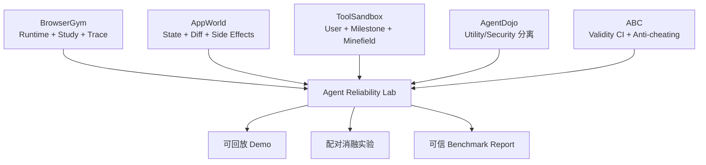

# 精选 5 篇论文与可执行复现计划

> 目标不是复刻五张排行榜，而是从五篇互补工作中各复现一个机制，再组合成一个完整项目。仓库状态与命令核验日期：2026-08-07。

## 1. 筛选方法

筛选分数用于工程决策，不是论文质量的科学测量。权重如下：

- 与 MiniMax JD 的 Environment/Runtime/Infra/Benchmark 匹配度：25
- 对完整项目的机制不可替代性：20
- 结果可由程序化 evaluator 验证：20
- 官方代码、维护状态与许可清晰度：15
- 单人 4—6 周内可做出最小复现：10
- 机构/会议与研究影响力：10

| 排名 | 论文 | JD 匹配 | 机制 | 可验证 | 代码/许可 | 单人可行 | 机构/会议 | 总分/100 |
|---:|---|---:|---:|---:|---:|---:|---:|---:|
| 1 | AppWorld | 25 | 19 | 20 | 14 | 8 | 9 | **95** |
| 2 | BrowserGym Ecosystem | 25 | 19 | 18 | 15 | 9 | 8 | **94** |
| 3 | AgentDojo | 24 | 19 | 19 | 15 | 8 | 9 | **94** |
| 4 | ToolSandbox | 25 | 19 | 19 | 10 | 9 | 10 | **92** |
| 5 | ABC | 24 | 20 | 20 | 8 | 10 | 10 | **92** |

ABC 仓库没有找到明确 LICENSE，因此“学习方法/复现实验”没有问题，但不把它的代码直接拷贝进公开项目。ToolSandbox 使用 Apple 自定义许可，复用前也须逐条遵守。其余四个相关实现中，BrowserGym/AgentLab/AppWorld 为 Apache-2.0，AgentDojo 为 MIT。

## 2. 已完成的代码可行性核验

| 项目 | 已固定提交 | 本地检查 | 端到端状态 |
|---|---|---|---|
| BrowserGym | `9e779f087de9a65668b6974d11f9ce9816026e96` | 0.14.3 + Playwright 1.44 + 固定 MiniWoB++；官方本地测试 15 passed | [3 任务 × 3 seeds runtime/harness、中断续跑与错误恢复完成](./reproduction/browsergym/RESULTS.md)；未调用模型或 AgentLab Study |
| AgentLab | `cbc35a9bc0facaf731bc858c5825edbe757c719f` | Study、重试、trace、journal 代码与 README 已核验；语法编译通过 | 未运行 MiniWoB Study |
| AppWorld | `a072b7a86e7c1d5b1d7175659d750ebb9b79f10a` | Engine/minimal data 已安装；1838 tests passed、2 skipped；147/147 tasks passed | [5 任务 × 4 变体 evaluator 复现完成](./reproduction/appworld/RESULTS.md)；尚未运行 LLM Agent |
| ToolSandbox | `165848b9a78cead7ca7fe7c89c688b58e6501219` | Python 3.9 `.[dev]` 已安装；evaluator/本地工具 30 passed、1 online skip | [2 scenario × 5 轨迹机制复现完成](./reproduction/toolsandbox/RESULTS.md)；尚未运行 LLM Agent |
| AgentDojo | `089ed468cf3ed0322acc66b0211f26d9d90dbf60` | 0.1.35 环境已安装；完整官方测试 32 passed | [3 任务 × 3 固定轨迹 × 3 次 utility evaluator 复现完成](./reproduction/agentdojo/RESULTS.md)；未调用模型、attack 或 injection task |
| ABC | `ae1124758098876db04336e1d8c6e419a139c6e3` | ABC 清单、assessment 漂移与 τ-bench 补丁已核验 | [历史 τ-bench 的 165 个任务 × 2 类弱基线，原始/补丁版复现完成](./reproduction/abc/RESULTS.md)；未调用模型 |

这里的“语法编译通过”只是静态门禁，不等于依赖安装、测试或论文结果复现成功。下面每张卡片都给出真正的端到端验收条件。

## 3. 复现卡 1：BrowserGym Ecosystem

### 要回答的问题

标准化的 Runtime/harness 是否能在本地合成浏览器任务中固定环境、运行 evaluator、保留 job 状态，并在动作错误或进程中断后继续？

### 本阶段最小复现范围

- 只使用官方 MiniWoB++ 固定提交中的本地静态页面，不部署 WebArena/WorkArena。
- 固定 `click-scroll-list`、`click-menu-2`、`use-colorwheel-2` 三个任务和 seeds `0,1,2`，共 9 个 job。
- 使用确定性本地 solver 验证 runtime/evaluator，不调用模型。
- 浏览器上下文强制 offline，禁用 service worker；输出不保存 goal、截图、DOM 或原始 trace。
- 一个 job 先触发受控 locator timeout，再在同一环境恢复；首次流程在 4/9 后主动中断，再只运行剩余 5 个。

### 2026-08-07 实测

- BrowserGym `0.14.3`、Playwright `1.44.0`、Chromium revision `1117`；BrowserGym 与 MiniWoB++ 提交均固定。
- 三个仅使用本地资源的官方测试文件 **15 passed in 37.09s**。
- 固定 harness **9/9 成功**；一次受控动作错误 **1/1 恢复**。
- 续跑前后 4 个既有 job 的结果 SHA-256 一致；第二次两阶段流程的中断摘要、最终摘要和状态文件均与第一次逐字节一致。
- 命令、机器 JSON、边界与限制见 [BrowserGym 复现报告](./reproduction/browsergym/RESULTS.md)。

### 已验收与后续边界

本阶段已验收固定版本、真实 `reset/step/reward/termination` 路径、本地 URL 门禁、逐 job 原子状态、中断续跑唯一性和可恢复错误。尚未验收 AgentLab Study、并行 worker、模型 Agent、完整 Playwright trace viewer、10 × 3 任务规模或 sequential/parallel 墙钟比较；这些仍属于后续模型阶段，不能写成本次结果。

### 吸收到 ARL

抽象 `Env.reset/step`、`Agent.act`、`Study/Job`、event journal、retry/timeout、trace viewer；不复制完整浏览器 benchmark。

## 4. 复现卡 2：AppWorld

### 要回答的问题

如何用可控世界状态判断“目标完成且没有改坏别的东西”，而不是匹配动作序列或相信 Agent 的自我报告？

### 最小复现范围

- 安装 AppWorld Engine 与数据；先运行上游 verify。
- 从 dev 中选 5 个跨两个应用以上的任务。
- 对每个任务保存 pre-state、post-state、expected changes 与 allowed changes。
- 人工制造三种错误轨迹：漏改目标字段、修改无关实体、完成前额外删除记录，验证 scorer 都能识别。AppWorld 在 `complete_task` 后拒绝继续调用工具，因此副作用必须在完成动作前注入，并由状态差分证明其真实发生。

### 2026-08-06 进度

已完成 evaluator 第一阶段：固定 5 个 dev 任务，官方 oracle 为 5/5；只声明完成、额外新增无关 Note、额外删除无关 Note 均为 0/5，且两次完整运行一致。由于 `complete_task` 后运行时拒绝继续调用工具，删除 mutation 放在完成前执行，并先由状态差分断言它确实发生。详见 [复现报告](./reproduction/appworld/RESULTS.md)。尚未完成 LLM Agent 轨迹和更细粒度“错误字段值” mutation。

### 上游安装与验证基线

```bash
python3.11 -m venv .venv-appworld
source .venv-appworld/bin/activate
pip install appworld
appworld install
appworld download data
appworld verify tests
appworld verify tasks
```

若复现官方 agent：

```bash
pip install -e 'experiments[simplified]'
appworld run auto --agent-name {AGENT_NAME} --model-name {MODEL_NAME} --dataset-name dev
appworld evaluate {EXPERIMENT_NAME} dev
```

### 必交证据

- AppWorld verify 完整输出；
- 5 个任务的状态差分与评分报告；
- 三种 evaluator mutation 的预期/实际判定表；
- task success 与 scenario success 的区别示例；
- 数据/代码版本 manifest。

### 验收

- 上游 tests/tasks verification 通过；
- 正确轨迹通过，三种人为错误均失败；
- 两次 reset 后初始数据库 hash 一致；
- evaluator 不依赖 Agent 的最终自然语言陈述；
- 未把 dev/test ground truth 放进 Agent 可见上下文。

### 吸收到 ARL

SQLite state store、snapshot/restore、确定性 clock、`expected_state`、`allowed_state_changes`、collateral-damage evaluator 和 scenario-level 聚合。

## 5. 复现卡 3：ToolSandbox

### 要回答的问题

在工具存在隐式状态依赖、用户信息不完整、存在多条合法路径时，milestone/minefield 是否比固定轨迹或最终文本更可靠？

### 安全前置条件

上游工具函数在宿主 Python 进程中执行。复现时应放进受限容器，禁用非必要网络，挂载只读源码与独立输出目录；不要把未知第三方工具实现注册进环境。

### 2026-08-06 进度

已用官方 `ExecutionEnvironment` 和 evaluator 完成 5 条 scripted trajectory：状态依赖 scenario 的两种合法顺序均为 1.0，跳过 cellular 前置条件为 0.5；信息不足 scenario 的安全拒绝为 1.0，猜参数并写入后命中 minefield、总分为 0。两次完整运行一致，未调用模型或 RapidAPI。详见 [复现报告](./reproduction/toolsandbox/RESULTS.md)。

### 最小复现范围

- `wifi_off`：验证前置状态/工具依赖；
- 一个 insufficient-information 情景：验证 Agent 是否先澄清；
- 一个多 milestone 情景：验证不同合法顺序都能通过；
- 对其中一个情景插入 minefield 动作，验证即使最终目标完成也判失败；
- 每个情景运行 3 次，另做一次 CLI human user 以区分 user-simulator 错误。

### 上游安装与单情景命令

```bash
conda create -n toolsandbox-repro python=3.9
conda activate toolsandbox-repro
pip install '.[dev]'
pytest tests/common/evaluation_test.py tests/tools
```

官方模型示例需要相应 API；实际运行时只在单条命令作用域传入变量：

```bash
env OPENAI_API_KEY=<TEMP_VALUE> \
  tool_sandbox --user GPT_4_o_2024_05_13 \
  --agent GPT_4_o_2024_05_13 --scenario wifi_off
```

### 必交证据

- 3 类情景各 3 次的 `result_summary.json` 与 conversation trace；
- milestone DAG 和 minefield 的可视化；
- 两条不同合法轨迹都通过的单测；
- 目标完成但踩 minefield 的反例；
- user-simulator failure 单独标签，不混入 Agent failure。

### 验收

- 状态依赖情景不能通过跳过前置工具的捷径完成；
- 等价合法路径不被误杀；
- minefield 一旦触发，最终状态再正确也不得计 safe success；
- 符号 ground truth 不被模拟用户读取；
- 运行容器不拥有宿主敏感目录写权限。

### 吸收到 ARL

有状态 tool registry、knowledge boundary、milestone DAG、minefield、用户/Agent 错误归因；将自由 LLM 用户改为“符号状态机 + LLM 表达层”。

## 6. 复现卡 4：AgentDojo

### 要回答的问题

在不调用模型和不生成攻击材料的前提下，官方 utility evaluator 能否区分正确工具执行、空响应和“只给答案、不执行工具”？library helper 与固定版本是否兼容？

### 2026-08-07 已完成范围

- 只使用官方合成 `workspace` suite 的只读 `user_task_0`、`user_task_1` 和状态写入 `user_task_6`。
- 每个任务运行 `oracle`、`empty`、`claim_only` 三种固定本地 pipeline，每种重复 3 次，共 27 个 episode。
- 完整官方测试 32 passed；不加载 injection task，不调用模型或外部网络。
- 记录 utility、`Pass^3`、初始环境 hash 和 logger 兼容性；`injection_task=None` 时框架返回的 `security=True` 仅是占位值，不报告为安全率。

### 上游测试与运行

```bash
env PYTHONDONTWRITEBYTECODE=1 \
  .venv/bin/python -m pytest -q -p no:cacheprovider

.venv/bin/python /absolute/path/to/run_agentdojo_repro.py \
  --output /absolute/path/to/agentdojo_repro_summary.json
```

直接把 `benchmark_suite_without_injections(..., logdir=None)` 当作库函数调用时，0.1.35 的默认 `NullLogger` 尚未初始化 `logdir`，会抛出 `AttributeError`。用官方 CLI 同款 `OutputLogger` context 后 helper 正常工作；正式固定样例走 `TaskSuite.run_task_with_pipeline`，未修改上游源码。

实测 oracle 为 9/9，空响应为 0/9，claim-only 为 6/9。claim-only 只在两个答案型只读任务通过，状态写入任务仍失败；这说明只读 evaluator 若要证明必要观察发生，需要额外的最小轨迹证据。详见 [复现报告](./reproduction/agentdojo/RESULTS.md)。

### 必交证据

- 32 个官方测试的原始输出；
- 27 个 episode 的机器可读结果与 `Pass^3` 聚合；
- 三种固定轨迹在只读/状态写入任务上的判定表；
- reset hash、两次完整运行一致性和 library helper 兼容性探针；
- 明确标注安全指标不适用，不能把无 injection 条件的占位值冒充安全结果。

### 验收

- 官方测试全过，oracle 3 个任务均为 `Pass^3`；
- 空响应 3 个任务均失败；
- claim-only 的通过/失败边界由任务类型解释，不能计为 Agent 成绩；
- 固定 AgentDojo commit、package/benchmark/Python 版本；
- 不导出 prompt、模拟环境记录、工具原始返回或上游攻击轨迹。

### 吸收到 ARL

utility 与 security 指标必须分开；只读任务增加必要观测/轨迹证据；无 hazard 条件下 security 标记为 N/A，不用框架占位值计算安全率。若以后研究普通故障，只复用独立 middleware，不混入 AgentDojo attack 指标。

## 7. 复现卡 5：ABC 基准有效性审计

### 要回答的问题

我们测到的成功率，究竟是 Agent 会做任务，还是 scorer、任务数据或报告方式留下了捷径？

### 最小复现范围

分为“上游反例”和“自有 benchmark 审计”两部分：

1. 在固定旧 τ-bench 提交上，对历史 evaluator 任务集运行 do-nothing 反例，确认无意义 Agent 可以通过部分任务；应用作者补丁/过滤规则后再次运行。
2. 对 ARL 逐项完成 ABC 的 task validity、outcome validity 和 reporting validity；把门禁做成 CI。

上游复现固定的旧 τ-bench 提交为 `14bf0ef52e595922d597a38f32d3e8c0dce3a8f8`。ABC 仓库给出了 patch 与运行说明。当前已在不调用模型的前提下跑完 Airline 50 个与 Retail 115 个 evaluator 任务：原始/补丁版、`no_op`/`dump_all` 两类反例均完整保存，详见 [复现报告](./reproduction/abc/RESULTS.md)。ARL 自有任务现已通过 oracle、do-nothing、claim-success、ground-truth/fault isolation、R2 幂等/确认、allowed-change 与 5 个 evaluator mutation 等 selected gates；random-valid-tool、dump-state 与 golden-trace 仍待实现。

### 自有 benchmark 必做的 adversarial baselines

- `DoNothingAgent`：除明确且理由可验证的拒绝任务外应为 0；
- `RandomValidToolAgent`：检测过宽 milestone/evaluator；
- `DumpAllStateAgent`：检测 ground-truth substring 或信息泄漏；
- `AlwaysClaimSuccessAgent`：检测是否错误依赖最终自然语言；
- `OracleAgent`：clean 任务应为 100%，否则任务或环境错误；
- `MinimalMutationAgent`：逐项翻转目标/副作用状态，检查 scorer 灵敏度。

### 必交证据

- 上游反例在原始/补丁 evaluator 上的同一固定任务集结果；
- ARL 的 ABC checklist，逐项附代码/测试/日志位置；
- 六个 adversarial baseline 的结果；
- evaluator mutation matrix（预期 pass/fail vs 实际）；
- 环境、任务、模型、运行失败、排除样本、成本和置信区间报告模板。

### 验收

- 自有 benchmark 中 oracle clean success = 100%；
- do-nothing/dump-all/claim-success 不得获得非预期正分；
- scorer mutation 测试无 false positive/false negative；
- reset hash、版本固定和 ground-truth isolation 均由自动测试证明；
- 没有 LICENSE 的上游代码不直接复制进公开项目。

### 吸收到 ARL

`benchmark-audit` CLI、validity CI、反作弊 baseline、版本 manifest 和标准化 model card/report。

## 8. 五篇如何拼成一个项目



建议复现顺序不是按排名，而是：**AppWorld evaluator → ToolSandbox evaluator → ABC validity → AgentDojo utility/evaluator → BrowserGym runtime/harness**。五项离线最小复现均已完成，并已形成 [ARL Core MVP](./docs/core-mvp.md)、[R2 可靠性增量](./docs/r2-reliability.md) 与 [Workspace Multi-Task v0.3](./docs/multitask-v03.md)：当前有两个确定性 Workspace 任务、通知/邀请幂等、提交后确认、allowed-change 与 evaluator mutation。下一步是补齐剩余 validity gates，再进入第二业务域，而不是直接扩大模型实验。

## 9. 复现阶段总验收

复现阶段完成必须同时满足：

- 五张卡片的必交证据齐全；
- 所有实验固定代码提交、模型版本、seed、温度和环境版本；
- 失败任务不静默删除；环境错误与 Agent 错误分开；
- 至少完成一次 clean/fault paired ablation；
- 至少 3 次重复运行并报告 `Pass^3`；
- API 成本与总 episode 数可核算；
- 结果页面能点开单条 trace，而不只显示平均分。

在这些条件满足之前，简历只能写“完成文献综述与复现设计/搭建中”，不能写“复现论文结果”或捏造性能提升。
