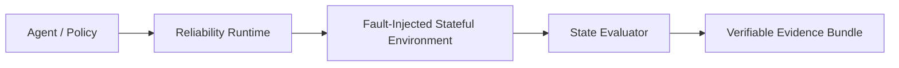

# Agent Reliability Lab

Fault-injection benchmark and reliability runtime for stateful tool-using agents.

[](https://github.com/Hai-qq/agent-reliability-lab/actions/workflows/ci.yml)
[](./pyproject.toml)
[](./LICENSE)

[中文说明](./README.zh-CN.md) · [Evidence Explorer](https://hai-qq.github.io/agent-reliability-lab/) · [Methodology](./docs/methodology.md) · [Claim registry](./docs/claims-registry.md)



ARL provides three things that are usually missing from agent demos:

- **Deterministic fault injection** at declared state-transition boundaries.
- **Runtime intervention comparison** on the same task/seed/trial/model population.
- **Verifiable state-level evidence** instead of self-reported task completion.

The core runtime has no third-party runtime dependencies. Smoke, verification, and
analysis are local and make zero model, provider, network, or credential calls.

## Five-minute quickstart

```bash
git clone https://github.com/Hai-qq/agent-reliability-lab.git
cd agent-reliability-lab
python -m pip install -e .

arl doctor
arl run smoke --output evidence/local-smoke
arl verify evidence/local-smoke
arl analyze evidence/local-smoke
```

The committed example is independently verifiable:

```bash
arl verify evidence/arl-smoke-v1
```

No `PYTHONPATH` setup or provider key is needed. `arl run smoke` exercises R0/R1/R2 in
clean and fault conditions and creates a strict `arl-evidence-v1` bundle. Output paths
must not already exist.

## Current evidence status

| Study | Saved facts | Claim status | Public episode evidence |
| --- | --- | --- | --- |
| v0.28 Flash + Qwen | Infrastructure valid; Qwen readiness failed | **Blocked — exploratory only, no confirmatory claim** | Not materialized as v1 ledger |
| v0.29 prospective holdout | 2,592 scheduled episodes; 2 unrecovered Qwen HTTP 503 errors; 4 Qwen monetary-cap violations; infrastructure and Qwen readiness failed | **Invalid for inference — descriptive aggregates only** | **NOT_MATERIALIZED** |
| v0.30 | 48-template design and scripted preflight | **No model results** | Scripted fixture only |
| `arl-smoke-v1` | 54 local scripted episodes, verified bundle | Installation evidence only | Materialized |

Positive descriptive point estimates in v0.28/v0.29 do not override failed gates. No
failed cell was rerun, deleted, or relabelled. The public checkout does not include the
ignored v0.29 full summary/study ledger, so ARL does not fabricate a 2,592-episode
public bundle. See the [claim registry](./docs/claims-registry.md) and
[threats to validity](./docs/threats-to-validity.md).

## What is stable in 0.4.0

The supported public namespaces are:

- `arl.runtime`: `AgentPolicy` and `ReliabilityRuntime` Protocols plus the legacy core.
- `arl.environments`: `StatefulEnvironment`.
- `arl.faults`: `FaultInjector`.
- `arl.evaluation`: `StateEvaluator`.
- `arl.providers`: optional `ModelBackend` boundary.
- `arl.studies`: token budgets and frozen blocked schedules.
- `arl.evidence`: schemas, redaction, deterministic bundles, migration, and verifier.
- `arl.analysis`: paired estimands, cluster bootstrap, and exact sensitivity.
- `arl.cli`: one offline-first command surface.

Historical packages such as `arl_holdout_v29` remain available for reproduction, but
new integrations should not import them. Distribution, study-contract, evidence-schema,
task-catalog, and artifact-bundle versions are intentionally separate; see the
[compatibility policy](./docs/versioning.md).

## Evidence contract

An `arl-evidence-v1` bundle contains a study contract, canonical gzip episode/provider
ledgers, aggregate, analysis, redaction policy, schemas, and a manifest that binds every
public file by size and SHA-256. Publication is deny-by-default: unknown fields and
secret-like keys/values fail the build.

```bash
arl verify BUNDLE
arl analyze BUNDLE
arl bundle NORMALIZED_PRIVATE_DIR --public-output NEW_DIR \
  --public-state-field status --public-state-field counter
```

Verification checks schema, exact files, all digests, episode cardinality and cell
uniqueness, frozen schedule order, aggregate recomputation, analysis inputs, logical
call linkage, redaction policy, and evaluator clauses against allowlisted public state.
See [the evidence schema guide](./docs/evidence-schema.md).

## Extend ARL locally

Each example uses only the stable Protocols and no network:

- [Minimal environment](./examples/minimal_environment/)
- [Custom fault](./examples/custom_fault/)
- [Custom runtime](./examples/custom_runtime/)

Lightweight entry-point group names are reserved as `arl.environments`, `arl.faults`,
`arl.runtimes`, and `arl.providers`; discovery never imports an adapter automatically.

## Development

```bash
python -m pip install -e ".[dev,validation]"
python scripts/manage_artifact_bundles.py restore \
  --bundle-dir artifacts/release_bundle_v15 --project-root .
python -m unittest discover -s tests -p "test_*.py"
ruff check src scripts tests examples
ruff format --check src scripts tests examples
mypy src/arl/evidence src/arl/analysis src/arl/studies src/arl/cli.py
```

The restore step recreates compacted v0.10–v0.13 formal/repeat trees and refuses to
overwrite existing targets. CI never calls a real provider.

## Documentation

- [Architecture](./docs/architecture.md)
- [Benchmark card](./docs/benchmark-card.md)
- [Methodology](./docs/methodology.md)
- [Threats to validity](./docs/threats-to-validity.md)
- [Running experiments](./docs/running-experiments.md)
- [Historical study index](./docs/history/README.md)
- [v0.30 design](./docs/studies/v030-design.md)
- [Maintainer checklist](./docs/maintainer-checklist.md)
- [Archival and provenance](./docs/archival.md)
- [Security](./SECURITY.md) · [Contributing](./CONTRIBUTING.md) · [Citation](./CITATION.cff)

ARL is MIT licensed. All benchmark states are project-owned synthetic data. Separately
authorized future provider studies must keep credentials and raw model content out of
committed evidence.
