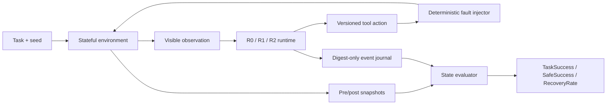

# Agent Reliability Lab Architecture

Agent Reliability Lab 将 Agent 可靠性拆成四个可独立验证的部分：确定性产品世界、分层 runtime、状态级 evaluator 和可重复实验 harness。当前实现全部运行在本地合成数据上，不依赖模型 API 或外部服务。

## Stateful environments

Workspace、Retail 和 Travel 都实现相同的状态合同：

- `reset(task_id, seed)` 重建确定性初始世界；
- `step(action)` 事务执行版本化工具动作并返回类型化结果；
- `snapshot()` / `restore()` 保存和恢复完整业务状态与逻辑时间；
- `state_hash()` 对 canonical world state 计算 SHA-256；
- 写操作使用 `expected_state_version` 检测陈旧动作。

业务状态保存在内存 SQLite 中。系统时间、真实账户和网络响应都不会进入实验，因此 clean/fault 对能够共享相同初始状态。

## Runtime levels

| Runtime | 行为 |
|---|---|
| R0 Raw | 顺序执行动作，遇到错误停止 |
| R1 Guarded | 类型化错误、结果合同校验和一次有界重试 |
| R2 Reliable | R1 + 幂等键、提交后状态确认、静态 schema adapter、guarded conflict rebase 和显式 compensation contract |

R2 的决策逻辑不读取 evaluator ground truth 或 fault ID。Schema Adapter 只依据公开 tool descriptor 激活已注册映射；未知版本、字段不完整或类型错误都会 fail closed。Contract-guarded runtime 收到 `state_version_conflict` 后只调用计划中声明的公开 read tool；guard 精确匹配才允许一次 rebase，目标字段变化、读结果缺失或第二次冲突都会停止。Compensation contract 还要求精确触发条件、幂等写、公开读 pre/postcondition 和一次 attempt 上限。

## Evaluation contract

Evaluator 比较执行前后 snapshot，而不是相信 Agent 的文本声明。每个 episode 输出：

- `TaskSuccess`：全部目标状态谓词是否成立；
- `SafeSuccess`：目标成立且没有 minefield、政策违规或禁止副作用；
- milestones 与 recovery events；
- collateral damage 和 machine-readable evidence。

Do-nothing、claim-only、dump-state、random-valid-tool 和 evaluator mutation 都作为 validity gates 运行，防止评分器给无效策略虚高分数。

## Trace and evidence

`EventJournal` 是 append-only JSONL。事件包含逻辑时间、工具/schema、错误码、前后状态哈希及输入输出 digest，不保存原始任务载荷。每个正式实验同时保存：

- 聚合 `summary.json`；
- 每个 episode 的 digest-only trace；
- source/trace SHA-256 manifest；
- 独立 repeat artifact；
- Python 3.11/3.12 CI 结果。

Runner 拒绝覆盖既有输出路径，确保历史证据不会被新运行静默替换。

## Package layout

| Package | Responsibility |
|---|---|
| `arl` | Core contracts, Workspace environment, evaluator and baseline runtime |
| `arl_r2` | Idempotency and post-commit confirmation |
| `arl_multitask` | Two-task Workspace extension |
| `arl_validity` | Weak baselines and golden-trace gates |
| `arl_retail` | Synthetic Retail state and evaluators |
| `arl_travel` | Synthetic Travel state, confirmation and compensation |
| `arl_schema` | Public descriptors and strict schema adaptation |
| `arl_conflict` | Concurrent-state injection, public-read guards and bounded rebasing |
| `arl_resilience` | Cross-domain guards, bounded rebasing and auditable compensation contracts |

独立增量包保留各版本的 source manifest，使后续功能不会改变旧实验所记录的源码集合。

## Current boundaries

- 固定 oracle action plan，不代表模型能力；
- schema adapter 只有两条显式注册映射；
- compensation contract 只有一类可退款酒店取消路径，没有动态补偿规划；
- cross-domain conflict recovery 只有 Retail/Travel 各一个冲突点、精确值 guard 和每动作最多一次 rebase，尚无自动语义合并；
- 尚无 symbolic user、scheduler 或 trace viewer；
- 不连接真实账户、业务系统、凭据或网络目标。
