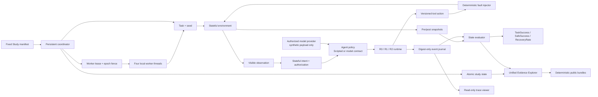
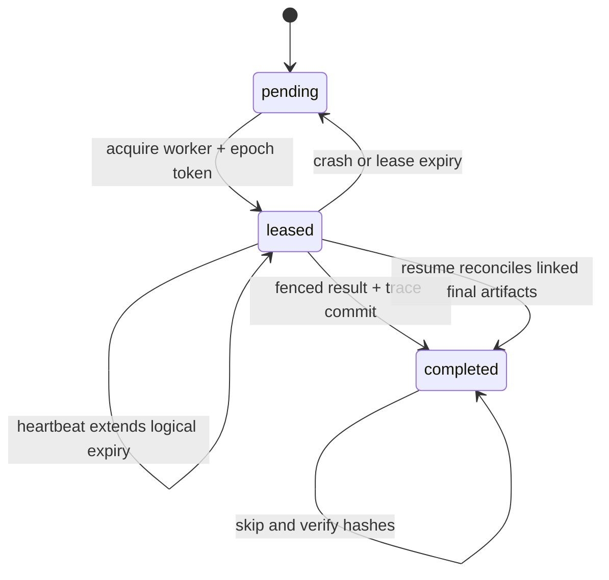

# Agent Reliability Lab Architecture

Agent Reliability Lab 将 Agent 可靠性拆成五个可独立验证的部分：确定性产品世界、状态化授权、分层 runtime、状态级 evaluator 和可重复实验 harness。benchmark 世界始终是本地合成数据；核心 scripted 路径不依赖外部服务。v0.16 冻结 provider-neutral Agent policy 边界和主实验合同，v0.17–v0.19 完成 8-task preflight/model pilot，v0.20–v0.21 补齐 24-task pack 并完成机制消融，v0.24 用经单独授权的 DeepSeek-V4-Flash backend 运行完整 432-episode non-thinking study 与 task-cluster 分析。v0.27 将相同 task/runtime/evaluator 合同扩展到 OpenCode Go 双模型矩阵；该 864-episode 运行因 provider/协议错误和模型资格门禁失败而保持无效。v0.28 在独立包中冻结全新的 Flash + Qwen 矩阵与 bounded transport retry，不复用已观察的 v0.27 episode。v0.29 再叠加 24 个新 task ID/request 和三个数据 seed，以独立 holdout 而不是原 cell 重试来复核 v0.28 结论。

## Stateful environments

Workspace、Retail 和 Travel 都实现相同的状态合同：

- `reset(task_id, seed)` 重建确定性初始世界；
- `step(action)` 事务执行版本化工具动作并返回类型化结果；
- `snapshot()` / `restore()` 保存和恢复完整业务状态与逻辑时间；
- `state_hash()` 对 canonical world state 计算 SHA-256；
- 写操作使用 `expected_state_version` 检测陈旧动作。

业务状态保存在内存 SQLite 中。系统时间、真实账户和网络响应都不会进入实验，因此 clean/fault 对能够共享相同初始状态。

## Runtime levels

| Runtime | 行为 |
|---|---|
| R0 Raw | 顺序执行动作，遇到错误停止 |
| R1 Guarded | 类型化错误、结果合同校验和一次有界重试 |
| R2 Reliable | R1 + 幂等键、提交后状态确认、静态 schema adapter、guarded conflict rebase 和显式 compensation contract |

R2 的决策逻辑不读取 evaluator ground truth 或 fault ID。Schema Adapter 只依据公开 tool descriptor 激活已注册映射；未知版本、字段不完整或类型错误都会 fail closed。Contract-guarded runtime 收到 `state_version_conflict` 后只调用计划中声明的公开 read tool；guard 精确匹配才允许一次 rebase，目标字段变化、读结果缺失或第二次冲突都会停止。Compensation contract 还要求精确触发条件、幂等写、公开读 pre/postcondition 和一次 attempt 上限。

v0.16 的 `arl_mainstudy.ActionRuntime` 把这条边界收敛为 action-at-a-time 控制器：Agent 只能产生相同的语义工具动作，不能自行设置 `idempotency_key` 或 `expected_state_version`；Runtime 按 R0/R1/R2 档位添加可靠性元数据、结果校验、重试与提交后确认。领域相关的写入识别、结果合同和确认查询由 adapter hook 提供，避免 generic controller 读取环境私有 ground truth。

v0.17 的 `arl_pilot` 在独立包中扩展同一边界：以 data-driven SQLite task spec 表达 8 个任务的公开请求/context、structured tools、业务状态 effect、clean/fault oracle、allowed changes 和 public-read guards。`PilotRuntime` 对六类故障分别实现 confirmation、bounded retry、精确 input/output schema adaptation、compatible rebase 与 3-step compensation；同一个 reactive oracle policy 在三档 Runtime 间不变。

v0.19 的 `arl_modelpilot` 实现 OpenAI-compatible DeepSeek Chat Completions backend，但不改变 Runtime 所拥有的能力。Backend 把带点号的内部工具名映射成 provider-safe 名称，校验并还原结构化 tool call；一个 provider response 中的 parallel tool calls 先进入本地 buffer，再由 action-at-a-time Runtime 逐个执行。密钥只来自 `DEEPSEEK_API_KEY` 环境变量；模型请求/响应仅在进程内保留，journal 和公开摘要只保存 digest、typed usage、latency、model ID 与 system fingerprint。

v0.20 的 `arl_mainpack` 将 blueprint 的全部 24 个模板实现成 data-driven environment/fault/oracle/evaluator fixture，保持每域 8 个任务、每故障族 4 个任务。v0.21 的 leave-one-out ablation 仍使用完全相同的 agent policy，只关闭一个 Runtime mechanism，从而验证结果变化确实落在预注册目标故障族。

v0.24 的 `arl_mainmodel` 将同一个 model/runtime 边界扩展到完整任务目录。每个 episode 有 call/input/output/cost 硬预算；在调用 provider 前先预留一个最大 response cap，避免“当前累计未超限、下一次响应落盘后才超限”的账本漏洞。Study scheduler 原子提交每个 result/trace 并在 resume 时核验 manifest 与既有文件哈希。`arl_analysis` 以 task template 为配对 cluster，保留 R1/R2 clean/fault 的全部 trial cell，再进行固定 seed 的非参数 bootstrap。

v0.25 的 `arl_dualmode` 保持 v0.24 已冻结源码不变，在独立层把第二配置绑定为 `deepseek-api/deepseek-v4-flash/DeepSeek-V4-Flash/thinking-high`。Adapter 只改变 provider 的 thinking 与 reasoning-effort 控制；任务、工具合同、Runtime、evaluator 和 reset state 不变。联合 bootstrap 以 task 为单位，同时保留两种模式的全部 R1/R2 clean/fault cells。因为两个 slot 的 model ID 相同且修订发生在 v0.24 结果之后，机器合同禁止把它解释成跨模型或前瞻性 confirmatory evidence。

v0.27 的 `arl_openstudy` 将 provider adapter 切换到 OpenCode Go，冻结 `deepseek-v4-flash` 与 `mimo-v2.5` 两个 binding，并运行全新 864-episode matrix。完整 run 中的一次 HTTP 503 与一次本地 model-protocol rejection 使基础设施 validity 失败，MiMo clean qualification 也未通过；analysis builder 因此 fail closed。该结果只作为失败证据保留。

v0.28 的 `arl_opencode_v28` 在观察 Qwen benchmark outcome 前冻结 `deepseek-v4-flash` 与 `qwen3.7-plus`。每个 logical model call 最多允许两次 bounded retry，并单独记录 logical calls、physical network attempts 和 recovered retries；只有 HTTP 429/500/502/503/504、transport error、invalid/timed-out response 可重试。任何未恢复的 provider/protocol error 仍使整个 study 无效。相同 gateway 只能支持 cross-model consistency，不能支持 cross-provider generalization。

v0.29 的 `arl_holdout_v29` 不修改 v0.28 的 43-file frozen source surface。新层把原有六类机制 archetype 映射到 24 个新 task ID/request，并为每个模板生成三个不同的 context、record identity 与 state namespace。432-episode reactive-oracle preflight 先验证 72 个 task-seed cell 的 reset、fault isolation、do-nothing、evaluator mutation 与机制计数；通过后才允许双模型 protocol probe、36-job canary 和 2,592-job formal。Readiness 逐 model × seed × runtime 计算，bootstrap 则以 task template 为 cluster 并把三个 seed 留在 cluster 内，避免把同一语义模板的 seed 变体当成 72 个独立任务。正式矩阵已完成 2,592/2,592，但两次未恢复 HTTP 503 与四个单 episode 成本超限使 infrastructure validity=false；两种 analysis builder 都先检查这一门禁并拒绝输出，因此完整运行不等于获得可推断结果。

v0.12 的 `CompensationWorkflowContract` 把这一合同扩成 2–8 个有界步骤：每个写入必须有独立幂等键，首个补偿步骤必须有 pre/postcondition，workflow 必须声明 terminal public-read guards。当前固定 Travel fallback 使用 4 个步骤（取消首选酒店、预订备选航班、预订备选酒店、解决请求）和 6 个终态断言；任何 step/terminal guard 不满足都会分类失败，不能把部分执行当成功。

## Stateful authorization

`arl_symbolic` 为四个 task template 注册结构化 intent schema。每个 schema 指定必填字段和一个可在提交前变化的字段；authorization token 绑定 session ID、intent revision 与 intent digest。Runtime 只有在 token authentic/current、必填字段完整且 proposed digest 与最新 intent 一致时才能安全提交。

One-shot policy 只请求一次并直接提交，用于暴露 missing/stale authorization。Revision-aware policy 会精确询问缺失字段、在提交前检查 freshness，并在 intent revision 后重新授权一次；用户不再响应时不写入并分类为 safe abort。Journal 只记录 revision、typed status、count、state hash 和 digest，不保存原始 intent 值或用户 cohort 标志。

## Evaluation contract

Evaluator 比较执行前后 snapshot，而不是相信 Agent 的文本声明。每个 episode 输出：

- `TaskSuccess`：全部目标状态谓词是否成立；
- `SafeSuccess`：目标成立且没有 minefield、政策违规或禁止副作用；
- milestones 与 recovery events；
- collateral damage 和 machine-readable evidence。

Do-nothing、claim-only、dump-state、random-valid-tool 和 evaluator mutation 都作为 validity gates 运行，防止评分器给无效策略虚高分数。

## Trace and evidence

`EventJournal` 是 append-only JSONL。事件包含逻辑时间、工具/schema、错误码、前后状态哈希及输入输出 digest，不保存原始任务载荷。每个正式本地实验同时保存：

- 聚合 `summary.json`；
- 每个 episode 的 digest-only trace；
- source/trace SHA-256 manifest；
- 独立 repeat artifact；
- Python 3.11/3.12 CI 结果。

Runner 拒绝覆盖既有输出路径，确保历史证据不会被新运行静默替换。

模型 pilot 的完整 `full-summary.json`、144 个 result 与 144 条 trace 保留在本地忽略目录。公开 `summary.json` 删除逐 episode 记录，但保存完整摘要 SHA-256、episode 集合 SHA-256、聚合指标、source/trace manifest、credential/trace audit 和限制；这样公开证据面保持紧凑，同时仍能回链到本地 evidence of record。

`arl_evidence` 在展示前重新读取 v0.10–v0.13 的 formal/repeat summary，按记录的 source manifest 重新哈希当前源码，并逐一重验 864 对 trace。只有全部历史 validity、source、summary parity、trace parity 与 synthetic-only 边界通过，才生成聚合 `evidence.json` 和自包含 `index.html`。Explorer 不嵌入 episode/session/event 载荷，也不替代原 artifact。

`arl_release` 将 v0.10–v0.13 的完整 study/trace 子树压成确定性 ZIP。每个成员按 POSIX 路径排序，timestamp、mode 和压缩级别固定；manifest 保存逐文件 SHA-256、canonical tree hash、bundle SHA-256 与 formal/repeat 恢复目标。公开 Git 树只保存一份 bundle，因为每组 formal/repeat tree 已验证逐字节相同；完整本地树不删除，只由 Git ignore。

## Study runtime

`arl_study` 把一个有序、不可变的 `StudyManifest` 映射为顺序 job 状态机。`arl_parallel` 在同一 manifest 上增加本地并发 lease 状态机：

Coordinator 在每次状态转换后使用 `fsync` 和原子替换写入 state。4 个 worker thread 并行执行一批最多 4 个 job，但 lease 获取、heartbeat、expiry、stale-commit fencing 和最终 commit 按 manifest 顺序确定性落盘。每个 attempt 带递增 epoch 和 manifest/job/worker 绑定 token；执行可以重试，只有当前且未过期的 lease 能提交唯一 final artifact。Resume 会校验完整 manifest 和 completed artifact 哈希、reconcile 已落盘提交，并显式回收中断遗留 lease。

完整 Study 还生成自包含 `viewer.html`。它只内嵌 summary 和 digest-only trace 中经过白名单选择的类型字段，不加载外部脚本、不调用网络 API，也不能改变 runtime 或实验状态。

## Package layout

| Package | Responsibility |
|---|---|
| `arl` | Core contracts, Workspace environment, evaluator and baseline runtime |
| `arl_r2` | Idempotency and post-commit confirmation |
| `arl_multitask` | Two-task Workspace extension |
| `arl_validity` | Weak baselines and golden-trace gates |
| `arl_retail` | Synthetic Retail state and evaluators |
| `arl_travel` | Synthetic Travel state, confirmation and compensation |
| `arl_schema` | Public descriptors and strict schema adaptation |
| `arl_conflict` | Concurrent-state injection, public-read guards and bounded rebasing |
| `arl_resilience` | Cross-domain guards, bounded rebasing and auditable compensation contracts |
| `arl_study` | Fixed manifests, atomic study state, fail-closed resume and offline trace viewer |
| `arl_parallel` | Four-worker lease coordinator, crash/expiry recovery and fenced final commits |
| `arl_scenarios` | Four audited task templates, four conflict sites and bounded workflow contracts |
| `arl_symbolic` | Stateful intent schemas, authorization fencing and paired repeated statistics |
| `arl_evidence` | Fail-closed artifact aggregation and self-contained read-only product evidence |
| `arl_release` | Deterministic compact bundles, verification and lossless artifact restoration |
| `arl_mainstudy` | 24-task blueprint、统一 Agent/Runtime 合同、模型绑定/预算门禁与 scripted smoke |
| `arl_pilot` | 8-task SQLite fixtures、6-fault unified runtime、reactive oracle 与 evaluator mutations |
| `arl_modelpilot` | DeepSeek-V4-Flash backend、parallel-call serialization、provider audit、144-job pilot aggregation 与公开摘要压缩 |
| `arl_mainpack` | 24-task data-driven fixtures、六类 fault、scripted preflight 与 leave-one-mechanism-out ablation |
| `arl_mainmodel` | 432-job single-slot manifest、硬模型预算、resume、provider audit 与 compact aggregate |
| `arl_analysis` | SafePass@3 task rows、分组诊断与配对 task-cluster bootstrap |
| `arl_dualmode` | DeepSeek V4 Flash thinking-high adapter、第二 432-job manifest、透明合同修订与 864-episode 双模式联合 bootstrap |
| `arl_openstudy` | OpenCode Go 双模型 binding、864-job manifest、provider catalog attestation、compact aggregate 与 fail-closed analysis |
| `arl_opencode_v28` | Flash/Qwen 修订合同、bounded transport retry、12-job canary、864-job matrix、fail-closed confirmatory gate 与显式 exploratory bootstrap |
| `arl_holdout_v29` | 24 个新 holdout task、三 seed 数据变体、432-job 零模型 gate、36-job canary、2,592-job manifest、逐 seed readiness 与 task-cluster analysis |

独立增量包保留各版本的 source manifest，使后续功能不会改变旧实验所记录的源码集合。

## Current boundaries

- 固定 oracle action plan，不代表模型能力；
- schema adapter 只有两条显式注册映射；
- Scenario Pack 只有 4 个固定任务模板、4 个冲突点和一个 Travel fallback workflow，没有动态补偿规划；
- Symbolic User 只模拟结构化有限状态响应和固定 engagement cohort，不是自然语言或真实用户模型；
- conflict recovery 使用精确值 guard 和每动作最多一次 rebase，尚无自动语义合并；
- Parallel Study 只支持单进程内 4 个线程和 logical-tick lease；没有分布式主机、wall-clock 网络 heartbeat、优先级或通用 DAG；
- viewer 是生成后的只读 HTML，不是实时控制台或 API；
- Evidence Explorer 的 headline gate 属于各自增量，不能当作跨版本排行榜；
- public bundles 只压缩已冻结的本项目证据；restore 拒绝既有目标，不能合并部分目录；
- 历史 v0.25 实现同一 provider model ID 的两个推理配置 binding；它们不是两个独立模型。v0.27/v0.28 使用两个 model ID，但 catalog listing 同样不是不可变权重 hash；
- v0.20 的原始 main pack 仍只有 1 个环境 seed；v0.29 另行冻结三个 holdout 数据 seed，但复用相同六类机制 archetype 和 tool schema，不能把它解释成 72 个独立语义任务；
- v0.24 已对全部 24 个任务运行 3 个重复 API trial，但 provider 不支持 sampling seed，模型输出不具备逐字节确定性；
- 模型 provider 是唯一可选外部调用面，只接收本项目合成任务；不连接真实账户、业务系统或网络目标，凭据不落盘；
- v0.24 的 432-episode non-thinking 结果不能代表跨模型结论；v0.27 双模型结果因基础设施门禁失败保持 exploratory-only；v0.28 的 864-episode 基础设施证据有效，但 Qwen clean readiness 未过，因此确认性 analysis 仍被拒绝，只提供明确标注的探索性区间；v0.29 的 2,592 episodes 已全部完成，但 infrastructure validity 与 Qwen readiness 均失败，所以确认性和探索性 analysis 都不存在，summary 中的 point estimate 只能作描述性诊断。
