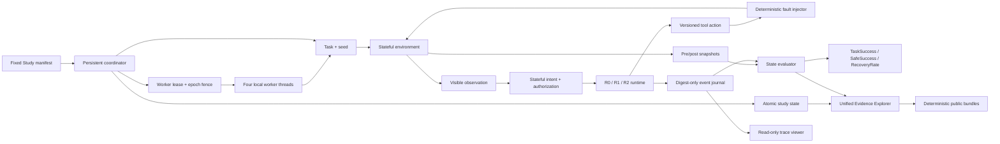
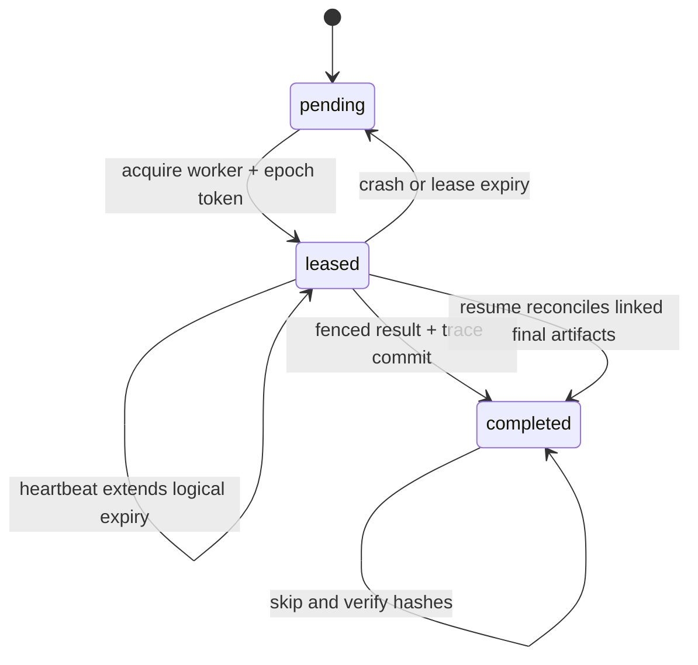

# Agent Reliability Lab Architecture

Agent Reliability Lab 将 Agent 可靠性拆成五个可独立验证的部分：确定性产品世界、状态化授权、分层 runtime、状态级 evaluator 和可重复实验 harness。当前实现全部运行在本地合成数据上，不依赖模型 API 或外部服务。

## Stateful environments

Workspace、Retail 和 Travel 都实现相同的状态合同：

- `reset(task_id, seed)` 重建确定性初始世界；
- `step(action)` 事务执行版本化工具动作并返回类型化结果；
- `snapshot()` / `restore()` 保存和恢复完整业务状态与逻辑时间；
- `state_hash()` 对 canonical world state 计算 SHA-256；
- 写操作使用 `expected_state_version` 检测陈旧动作。

业务状态保存在内存 SQLite 中。系统时间、真实账户和网络响应都不会进入实验，因此 clean/fault 对能够共享相同初始状态。

## Runtime levels

| Runtime | 行为 |
|---|---|
| R0 Raw | 顺序执行动作，遇到错误停止 |
| R1 Guarded | 类型化错误、结果合同校验和一次有界重试 |
| R2 Reliable | R1 + 幂等键、提交后状态确认、静态 schema adapter、guarded conflict rebase 和显式 compensation contract |

R2 的决策逻辑不读取 evaluator ground truth 或 fault ID。Schema Adapter 只依据公开 tool descriptor 激活已注册映射；未知版本、字段不完整或类型错误都会 fail closed。Contract-guarded runtime 收到 `state_version_conflict` 后只调用计划中声明的公开 read tool；guard 精确匹配才允许一次 rebase，目标字段变化、读结果缺失或第二次冲突都会停止。Compensation contract 还要求精确触发条件、幂等写、公开读 pre/postcondition 和一次 attempt 上限。

v0.12 的 `CompensationWorkflowContract` 把这一合同扩成 2–8 个有界步骤：每个写入必须有独立幂等键，首个补偿步骤必须有 pre/postcondition，workflow 必须声明 terminal public-read guards。当前固定 Travel fallback 使用 4 个步骤（取消首选酒店、预订备选航班、预订备选酒店、解决请求）和 6 个终态断言；任何 step/terminal guard 不满足都会分类失败，不能把部分执行当成功。

## Stateful authorization

`arl_symbolic` 为四个 task template 注册结构化 intent schema。每个 schema 指定必填字段和一个可在提交前变化的字段；authorization token 绑定 session ID、intent revision 与 intent digest。Runtime 只有在 token authentic/current、必填字段完整且 proposed digest 与最新 intent 一致时才能安全提交。

One-shot policy 只请求一次并直接提交，用于暴露 missing/stale authorization。Revision-aware policy 会精确询问缺失字段、在提交前检查 freshness，并在 intent revision 后重新授权一次；用户不再响应时不写入并分类为 safe abort。Journal 只记录 revision、typed status、count、state hash 和 digest，不保存原始 intent 值或用户 cohort 标志。

## Evaluation contract

Evaluator 比较执行前后 snapshot，而不是相信 Agent 的文本声明。每个 episode 输出：

- `TaskSuccess`：全部目标状态谓词是否成立；
- `SafeSuccess`：目标成立且没有 minefield、政策违规或禁止副作用；
- milestones 与 recovery events；
- collateral damage 和 machine-readable evidence。

Do-nothing、claim-only、dump-state、random-valid-tool 和 evaluator mutation 都作为 validity gates 运行，防止评分器给无效策略虚高分数。

## Trace and evidence

`EventJournal` 是 append-only JSONL。事件包含逻辑时间、工具/schema、错误码、前后状态哈希及输入输出 digest，不保存原始任务载荷。每个正式实验同时保存：

- 聚合 `summary.json`；
- 每个 episode 的 digest-only trace；
- source/trace SHA-256 manifest；
- 独立 repeat artifact；
- Python 3.11/3.12 CI 结果。

Runner 拒绝覆盖既有输出路径，确保历史证据不会被新运行静默替换。

`arl_evidence` 在展示前重新读取 v0.10–v0.13 的 formal/repeat summary，按记录的 source manifest 重新哈希当前源码，并逐一重验 864 对 trace。只有全部历史 validity、source、summary parity、trace parity 与 synthetic-only 边界通过，才生成聚合 `evidence.json` 和自包含 `index.html`。Explorer 不嵌入 episode/session/event 载荷，也不替代原 artifact。

`arl_release` 将 v0.10–v0.13 的完整 study/trace 子树压成确定性 ZIP。每个成员按 POSIX 路径排序，timestamp、mode 和压缩级别固定；manifest 保存逐文件 SHA-256、canonical tree hash、bundle SHA-256 与 formal/repeat 恢复目标。公开 Git 树只保存一份 bundle，因为每组 formal/repeat tree 已验证逐字节相同；完整本地树不删除，只由 Git ignore。

## Study runtime

`arl_study` 把一个有序、不可变的 `StudyManifest` 映射为顺序 job 状态机。`arl_parallel` 在同一 manifest 上增加本地并发 lease 状态机：

Coordinator 在每次状态转换后使用 `fsync` 和原子替换写入 state。4 个 worker thread 并行执行一批最多 4 个 job，但 lease 获取、heartbeat、expiry、stale-commit fencing 和最终 commit 按 manifest 顺序确定性落盘。每个 attempt 带递增 epoch 和 manifest/job/worker 绑定 token；执行可以重试，只有当前且未过期的 lease 能提交唯一 final artifact。Resume 会校验完整 manifest 和 completed artifact 哈希、reconcile 已落盘提交，并显式回收中断遗留 lease。

完整 Study 还生成自包含 `viewer.html`。它只内嵌 summary 和 digest-only trace 中经过白名单选择的类型字段，不加载外部脚本、不调用网络 API，也不能改变 runtime 或实验状态。

## Package layout

| Package | Responsibility |
|---|---|
| `arl` | Core contracts, Workspace environment, evaluator and baseline runtime |
| `arl_r2` | Idempotency and post-commit confirmation |
| `arl_multitask` | Two-task Workspace extension |
| `arl_validity` | Weak baselines and golden-trace gates |
| `arl_retail` | Synthetic Retail state and evaluators |
| `arl_travel` | Synthetic Travel state, confirmation and compensation |
| `arl_schema` | Public descriptors and strict schema adaptation |
| `arl_conflict` | Concurrent-state injection, public-read guards and bounded rebasing |
| `arl_resilience` | Cross-domain guards, bounded rebasing and auditable compensation contracts |
| `arl_study` | Fixed manifests, atomic study state, fail-closed resume and offline trace viewer |
| `arl_parallel` | Four-worker lease coordinator, crash/expiry recovery and fenced final commits |
| `arl_scenarios` | Four audited task templates, four conflict sites and bounded workflow contracts |
| `arl_symbolic` | Stateful intent schemas, authorization fencing and paired repeated statistics |
| `arl_evidence` | Fail-closed artifact aggregation and self-contained read-only product evidence |
| `arl_release` | Deterministic compact bundles, verification and lossless artifact restoration |

独立增量包保留各版本的 source manifest，使后续功能不会改变旧实验所记录的源码集合。

## Current boundaries

- 固定 oracle action plan，不代表模型能力；
- schema adapter 只有两条显式注册映射；
- Scenario Pack 只有 4 个固定任务模板、4 个冲突点和一个 Travel fallback workflow，没有动态补偿规划；
- Symbolic User 只模拟结构化有限状态响应和固定 engagement cohort，不是自然语言或真实用户模型；
- conflict recovery 使用精确值 guard 和每动作最多一次 rebase，尚无自动语义合并；
- Parallel Study 只支持单进程内 4 个线程和 logical-tick lease；没有分布式主机、wall-clock 网络 heartbeat、优先级或通用 DAG；
- viewer 是生成后的只读 HTML，不是实时控制台或 API；
- Evidence Explorer 的 headline gate 属于各自增量，不能当作跨版本排行榜；
- public bundles 只压缩已冻结的本项目证据；restore 拒绝既有目标，不能合并部分目录；
- 尚无自然语言用户或模型 adapter；
- 不连接真实账户、业务系统、凭据或网络目标。
