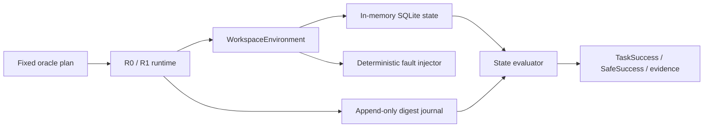

# ARL Core MVP v0.1

这是 Agent Reliability Lab 的第一个可运行产品增量。它把确定性状态环境、类型化工具结果、状态 evaluator、append-only journal 与 R0/R1 runtime 接成一条完整的本地链路。

> 本文保留 v0.1 的历史边界；后续增量见 [R2 v0.2](./r2-reliability.md)、[Workspace Multi-Task v0.3](./multitask-v03.md)、[Validity Gates v0.4](./validity-v04.md)、[Retail v0.5](./retail-v05.md)、[Travel v0.6](./travel-v06.md)、[Schema Adapter v0.7](./schema-adapter-v07.md)、[Conflict Recovery v0.8](./conflict-recovery-v08.md)、[Cross-Domain Resilience v0.9](./cross-domain-resilience-v09.md) 与 [Study Runtime v0.10](./study-runtime-v10.md)。

## 一句话结论

在同一组 3 个初始 seed 上，R0 遇到一次预提交 timeout 后全部失败；R1 通过错误分类、结果校验和一次有界重试全部恢复。该结果证明当前 harness 的恢复路径有效，不代表模型能力或总体性能。

## 当前范围

- 域：完全合成的 Workspace 日历与邀请消息。
- 任务模板：`workspace.schedule_meeting_and_notify`。
- seeds：`0,1,2`。
- 条件：clean / 首次邀请调用发生一次 pre-commit timeout。
- runtime：`r0_raw` / `r1_guarded`。
- policy：固定 oracle action plan，不调用 LLM。
- 数据与网络：只使用 `@synthetic.invalid` 数据；无外部网络调用。

## 架构

### Environment

`WorkspaceEnvironment` 实现：

- `reset(task_id, seed)`：重建固定联系人和 seed 对应任务；
- `step(action)`：事务执行版本化工具动作，返回稳定的 `ok/retryable_error/fatal_error/conflict`；
- `state_hash()`：对任务、state version 与业务表做 canonical JSON SHA-256；
- `snapshot()/restore()`：完整保存与恢复世界状态、逻辑时间和 fault 计数；
- logical clock：只由显式工具尝试推进，不读取系统时间。

当前工具为 `calendar.create_event@1.0` 和 `messages.send_invitations@1.0`。重复 invitation 会触发事务回滚；错误动作不会改变业务状态哈希。

### Runtime

| Runtime | 当前实现 |
|---|---|
| `r0_raw` | 执行固定 action plan；遇到错误停止，不重试 |
| `r1_guarded` | R0 + typed error handling + 最多 1 次 retry + result/state contract validation |

R1 只对 `retryable_error` 重试；fatal error 和 state-version conflict 不重试。v0.1 的故障发生在提交前，所以安全重试不会产生重复写。timeout-after-commit 与幂等不属于本历史增量，已在后续 R2 单独实现。

### Trace 与 evaluator

每个 trace event 固定保存 episode/task/seed、父事件、逻辑时间、actor、事件类型、工具/schema、输入输出 digest、前后状态哈希、错误码和 harness-only fault ID。它不保存 action 参数、合成邮箱、原始 state 或模型内容。

Evaluator 只读取 pre/post snapshot 和 trace，不读取 policy 自我声明。它分别给出目标状态、额外日历事件、意外邀请、milestone、minefield 与恢复事件证据。

## 配对实验结果

| Runtime | Clean | Fault | SafeSuccess | Retry | RecoveryRate |
|---|---:|---:|---:|---:|---:|
| R0 Raw | 3/3 | 0/3 | 3/6 | 0 | 0% |
| R1 Guarded | 3/3 | 3/3 | 6/6 | 3 | 100% |

R1 相对 R0 的配对恢复率差为 `+1.0`。这里只有一个任务模板和确定性 oracle，不能据此推断一般化能力或统计显著性。

## 已通过的门禁

- 每个 seed 连续 reset 20 次，初始哈希唯一数均为 1；
- snapshot 修改后哈希改变，restore 后回到初始哈希；
- 重复 invitation 的部分写入完整回滚；
- do-nothing 与 claim-success 均不得分；
- 正确目标状态加额外日历事件时，TaskSuccess 保留但 SafeSuccess 失败；
- clean/fault、R0/R1 的同 seed 初始哈希一致；
- observation 不暴露 oracle/evaluator/expected/minefield 字段；
- 内部重复运行结果一致；外部第二次运行的 summary 与 12 条 trace 逐字节一致；
- 10 个 unit/integration/validity tests 全部通过。

## 尚未完成

- v0.1 本身不含 idempotency、timeout-after-commit、schema adapter 或 conflict recovery；后续 R2 已覆盖日历创建，schema adapter 已在 v0.7 实现，首条 guarded conflict rebase 已在 v0.8 实现并于 v0.9 扩展到 Retail/Travel；
- v0.1 本身只有一个 Workspace 任务；第二个 Workspace 任务已在 v0.3 实现，Retail 两任务已在 v0.5 实现，Travel 两任务已在 v0.6 实现；
- v0.1 本身没有 scheduler/resume 或 trace viewer；后续 [v0.10](./study-runtime-v10.md) 已实现本地顺序 Study 与离线 viewer，symbolic user 仍未实现；
- v0.1 本身不含 random-valid-tool、dump-state、allowed-change 等门禁；allowed-change 已在 v0.3 实现，random/dump/golden 已在 v0.4 实现；
- LLM Agent、独立随机重复、统计区间与主实验。

运行说明见 [Experiment Guide](./running-experiments.md)，机器结果见 [summary.json](../artifacts/workspace_paired/summary.json)。
