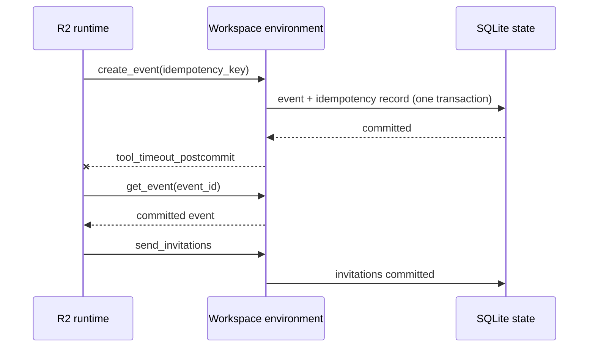

# ARL R2 可靠性增量 v0.2

R2 在 v0.1 的确定性 Workspace 上增加原子幂等记录、提交后超时和状态确认。它回答一个窄问题：写操作已经提交但响应丢失时，runtime 能否避免盲目重复写，并继续完成后续动作？

> 本文保留 v0.2 的历史边界；第二任务、通知幂等和 evaluator mutation 已在 [Workspace Multi-Task v0.3](./multitask-v03.md) 实现。

## 实验范围

- 任务：`workspace.schedule_meeting_and_notify`；seeds `0,1,2`。
- 条件：clean / 首次 `calendar.create_event` 事务提交后返回一次 timeout。
- 对照：`r1_guarded` / `r2_confirmed`，共 12 episodes。
- policy：固定 oracle action plan；没有 LLM、模型调用或外部网络。
- 世界：内存 SQLite，只使用 `@synthetic.invalid` 合成记录。

R1 使用相同的类型化错误与一次有界 retry，但不携带 idempotency key，也不查询确认。R2 为日历创建附加稳定 key；事件和幂等记录在同一事务提交。若收到提交后 timeout 且状态哈希已变化，R2 先调用只读 `calendar.get_event` 核对完整事件，再继续发送邀请。

## 配对结果

| Runtime | Clean | Fault | SafeSuccess | Blind retry | State confirmation | RecoveryRate |
|---|---:|---:|---:|---:|---:|---:|
| R1 Guarded | 3/3 | 0/3 | 3/6 | 3 | 0 | 0% |
| R2 Confirmed | 3/3 | 3/3 | 6/6 | 0 | 3 | 100% |

R1 的三个 fault episode 都在首次写已提交后盲重试，随后命中 `state_version_conflict`；最终各有 1 条会议、0 条邀请，因此 TaskSuccess 失败。R2 的三个 fault episode 各做 1 次查询确认、0 次盲重试，最终各有 1 条会议、2 条邀请和 1 条幂等记录，SafeSuccess 全部通过。配对恢复率差 `R2 - R1 = +1.0`。

这只是固定 oracle 与三个 seed 的机制验证，不能解释为模型提升或统计显著性。

## 已通过的 R2 门禁

- 提交后 timeout 返回 `retryable_error/tool_timeout_postcommit`，同时业务状态哈希和 state version 已改变；
- 相同 key + 相同请求重放返回缓存成功，state hash/version 不变且只保留 1 条会议；
- 相同 key + 不同请求返回 `conflict/idempotency_key_reused`，状态不变；
- snapshot/restore 同时恢复业务状态和幂等记录；
- 同 seed 的 clean/fault、R1/R2 初始哈希一致；每 seed 连续 reset 20 次只有 1 个初始哈希；
- fault ID、幂等 key 和 evaluator/oracle 信息不出现在 observation；
- 12 条 trace 不含合成邮箱、participants 或 recipients 原文；
- 内部 shadow run 一致；正式与独立 repeat 的 summary 和 12/12 traces 均逐字节一致；
- 19 tests 在 Python 3.12.2 与 3.11.15 均通过。

## 证据

- 正式机器结果：[summary.json](../artifacts/workspace_r2_postcommit/summary.json)
- 正式 trace：[traces/](../artifacts/workspace_r2_postcommit/traces/)
- 独立重复：[workspace_r2_postcommit_repeat/](../artifacts/workspace_r2_postcommit_repeat/)
- 命令、版本与哈希：[validation.log](../artifacts/workspace_r2_postcommit/validation.log)
- 实验命令：[Experiment Guide](./running-experiments.md)

## 限制与下一步

- v0.2 的幂等只覆盖 `calendar.create_event`；通知与邀请幂等已在 v0.3 扩展；
- 只有一种提交后故障、一个任务模板和三个确定性 seed；
- v0.2 本身尚不含 schema adapter、一般冲突恢复、补偿或用户澄清；schema adapter 已在后续 v0.7 实现，首条 guarded conflict rebase 已在 v0.8 实现；
- v0.2 只有一个 Workspace 任务；第二个 Workspace 任务已在 v0.3 实现，Retail 两任务已在 v0.5 实现，Travel 两任务已在 v0.6 实现；scheduler、trace viewer 与模型实验仍未实现；
- evaluator 将幂等记录视为 runtime metadata，不视为业务副作用。

后续 v0.3 已完成第二个 Workspace 任务、通知/邀请幂等、allowed-change 与 5 个 evaluator mutation，v0.4 已补 random/dump/golden 门禁，v0.5 已完成 Retail 最小域，v0.6 已完成 Travel 最小域与首条受控补偿，[v0.7](./schema-adapter-v07.md) 已完成输入/输出 schema drift 的静态适配，[v0.8](./conflict-recovery-v08.md) 已完成首条公开读 guard 与有界 state-version rebase。
